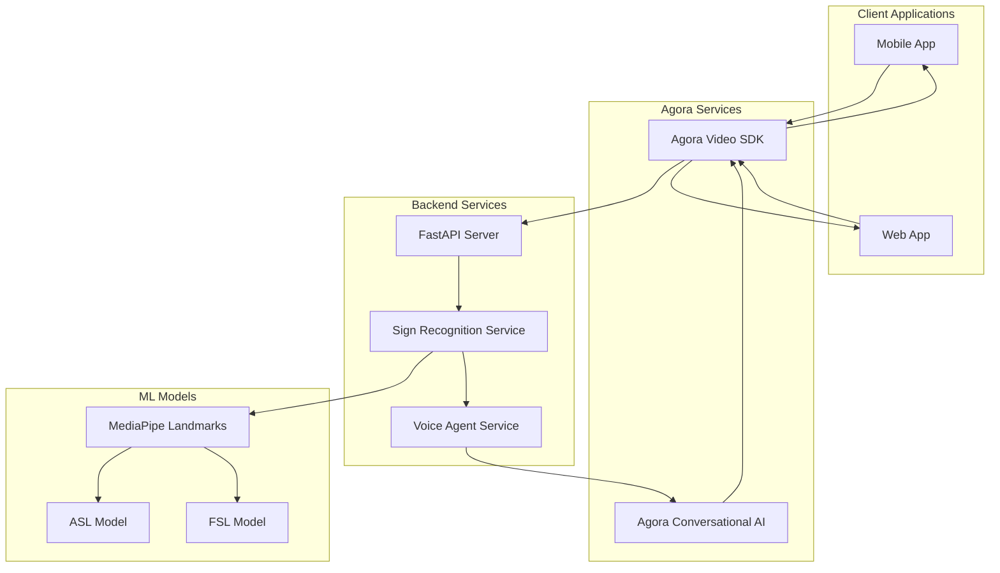
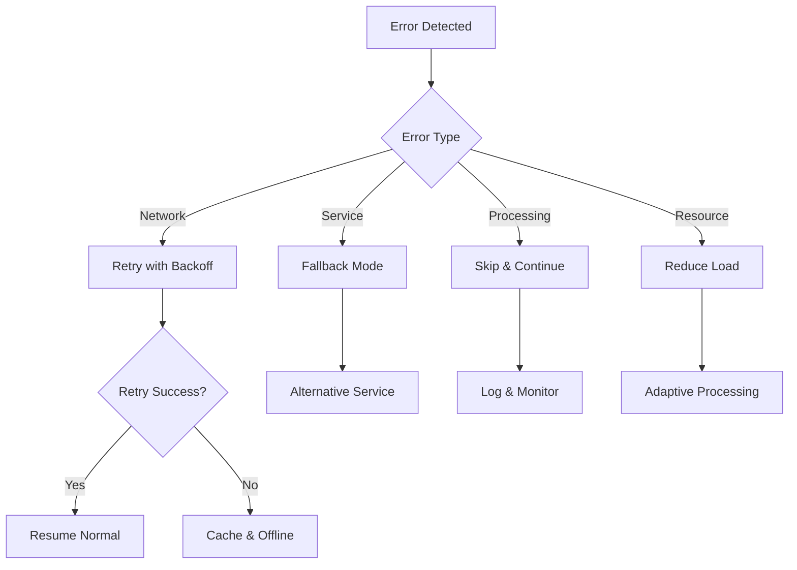

# Design Document

## Overview

This design document outlines the integration of Agora Video SDK and Agora Conversational AI into the existing Sign Language Translator (SLT) application. The system will leverage Agora's video streaming capabilities for real-time video capture and their Conversational AI service for natural speech synthesis, creating a seamless communication bridge between sign language users and spoken language users.

The integration builds upon the existing architecture which includes:
- Backend FastAPI service with MediaPipe-based sign recognition
- Mobile React Native application with Expo Camera
- Web React application with browser camera access
- Machine learning models for ASL and FSL recognition

## Architecture

The enhanced architecture follows a real-time processing pipeline:



### Key Architectural Changes

1. **Video Stream Integration**: Replace direct camera capture with Agora Video SDK streams
2. **Real-time Frame Processing**: Implement continuous frame extraction from video streams
3. **AI-Powered Speech Synthesis**: Replace basic TTS with Agora Conversational AI
4. **Bidirectional Communication**: Enable both sign-to-speech and speech-to-sign workflows

## Components and Interfaces

### 1. Agora Video Stream Manager

**Purpose**: Manages video stream capture and frame extraction using Agora Video SDK

**Key Methods**:
- `initializeVideoStream(channelName: string): Promise<void>`
- `extractFrame(): Promise<string>` - Returns base64 encoded frame
- `onFrameReady(callback: Function): void` - Event handler for new frames
- `cleanup(): Promise<void>`

**Integration Points**:
- Mobile: Integrates with existing `SignRecognition` component
- Web: Integrates with existing `CameraCapture` component
- Backend: Receives frames via existing `/recognize` endpoint

### 2. Enhanced Sign Recognition Service

**Purpose**: Processes video frames from Agora streams with improved real-time capabilities

**Key Enhancements**:
- Frame buffering and queue management
- Adaptive processing rate based on system load
- Improved error handling for stream interruptions

**Interface**:
```python
class EnhancedSignRecognitionService:
    def process_agora_frame(self, frame_data: str, metadata: dict) -> dict
    def set_processing_rate(self, fps: int) -> None
    def get_processing_stats(self) -> dict
```

### 3. Agora Conversational AI Integration

**Purpose**: Replaces basic TTS with natural, contextual speech synthesis

**Key Features**:
- Emotion-aware speech generation
- Context preservation across conversations
- Multiple voice options and languages
- Real-time audio streaming

**Interface**:
```python
class AgoraConversationalAIService:
    def synthesize_speech(self, text: str, emotion: str, context: list) -> dict
    def set_voice_parameters(self, voice_id: str, speed: float) -> None
    def stream_audio_to_channel(self, channel: str) -> None
```

### 4. Real-time Processing Coordinator

**Purpose**: Orchestrates the flow between video capture, recognition, and speech synthesis

**Responsibilities**:
- Frame rate optimization
- Processing queue management
- Error recovery and fallback handling
- Performance monitoring

## Data Models

### VideoFrameData
```typescript
interface VideoFrameData {
  frameId: string;
  timestamp: number;
  base64Data: string;
  channelName: string;
  userId: string;
  metadata: {
    width: number;
    height: number;
    quality: number;
  };
}
```

### SignRecognitionResult
```typescript
interface SignRecognitionResult {
  sign: string;
  confidence: number;
  timestamp: number;
  processingTime: number;
  modelLanguage: string;
  requestedLanguage: string;
  frameId: string;
}
```

### SpeechSynthesisRequest
```typescript
interface SpeechSynthesisRequest {
  text: string;
  emotion: string;
  context: string[];
  voiceSettings: {
    voiceId: string;
    speed: number;
    volume: number;
  };
  channelName: string;
  priority: 'normal' | 'high' | 'interrupt';
}
```

### AgoraChannelConfig
```typescript
interface AgoraChannelConfig {
  appId: string;
  channelName: string;
  token: string;
  userId: string;
  videoConfig: {
    resolution: string;
    frameRate: number;
    bitrate: number;
  };
  audioConfig: {
    sampleRate: number;
    channels: number;
  };
}
```

## Correctness Properties

*A property is a characteristic or behavior that should hold true across all valid executions of a system-essentially, a formal statement about what the system should do. Properties serve as the bridge between human-readable specifications and machine-verifiable correctness guarantees.*

### Property Reflection

After analyzing all acceptance criteria, several properties can be consolidated to eliminate redundancy:

- Properties 1.3 and 2.1 both test frame forwarding/processing - combined into Property 1
- Properties 3.1, 3.2, and 3.3 all test the speech synthesis pipeline - combined into Property 2  
- Properties 4.3 and 4.4 both test error handling with state preservation - combined into Property 3
- Properties 5.1, 5.3, and 5.4 all test cross-platform consistency - combined into Property 4

### Core Properties

**Property 1: Frame Processing Pipeline**
*For any* captured video frame, when sent to the Sign_Recognition_Service, the frame should be processed using the trained ML models and return a recognition result within 500ms
**Validates: Requirements 1.3, 2.1, 2.3**

**Property 2: Speech Synthesis Pipeline** 
*For any* recognized sign language text, when sent to Agora_Conversational_AI, the system should generate speech output and play it through audio output
**Validates: Requirements 3.1, 3.2, 3.3**

**Property 3: Error Recovery with State Preservation**
*For any* system error (network, processing, or service failures), the system should handle the error gracefully while maintaining user session state and providing appropriate fallback functionality
**Validates: Requirements 4.3, 4.4**

**Property 4: Cross-Platform Consistency**
*For any* platform (web or mobile), the system should provide equivalent video capture, sign recognition, and speech synthesis functionality with platform-appropriate optimizations
**Validates: Requirements 5.1, 5.3, 5.4**

**Property 5: Frame Rate Maintenance**
*For any* active video capture session, the system should maintain a minimum frame capture rate of 15 frames per second
**Validates: Requirements 1.2**

**Property 6: Gesture Recognition Accuracy**
*For any* detected sign language gesture, the Sign_Recognition_Service should identify the corresponding text or meaning with confidence scoring
**Validates: Requirements 2.2**

**Property 7: Sequential Speech Queuing**
*For any* sequence of recognized sign phrases, the system should queue and play speech output in chronological order
**Validates: Requirements 3.4**

**Property 8: Gesture Aggregation**
*For any* sequence of video frames containing the same gesture, the Sign_Recognition_Service should aggregate results to improve recognition accuracy
**Validates: Requirements 2.4**

**Property 9: Stream Reconnection**
*For any* video stream interruption, the system should attempt reconnection and maintain session continuity
**Validates: Requirements 1.4**

**Property 10: Resource Adaptive Processing**
*For any* system resource constraint, the system should adaptively reduce processing rate to maintain stability
**Validates: Requirements 4.5**

**Property 11: User Preference Persistence**
*For any* device switch, the system should maintain user preferences and session state across transitions
**Validates: Requirements 5.2**

**Property 12: API Rate Limit Handling**
*For any* approach to API rate limits, the system should implement appropriate throttling and queuing mechanisms
**Validates: Requirements 6.4**

**Property 13: Silent Frame Handling**
*For any* video frame with no recognizable gestures, the Sign_Recognition_Service should continue monitoring without generating output
**Validates: Requirements 2.5**

## Error Handling

### Error Categories and Recovery Strategies

1. **Network Connectivity Errors**
   - Automatic retry with exponential backoff
   - Local caching of recognition results
   - Graceful degradation to offline mode

2. **Agora Service Errors**
   - Fallback to direct camera capture
   - Alternative TTS when Conversational AI unavailable
   - Service health monitoring and alerting

3. **Processing Errors**
   - Frame skipping for temporary processing failures
   - Model fallback (ASL ↔ FSL) when primary model fails
   - Error logging with context preservation

4. **Resource Constraint Errors**
   - Dynamic frame rate adjustment
   - Processing queue management
   - Memory cleanup and optimization

### Error Recovery Patterns



## Testing Strategy

### Dual Testing Approach

The system requires both unit testing and property-based testing to ensure comprehensive coverage:

- **Unit tests** verify specific examples, edge cases, and error conditions
- **Property tests** verify universal properties that should hold across all inputs
- Together they provide comprehensive coverage: unit tests catch concrete bugs, property tests verify general correctness

### Property-Based Testing Requirements

- **Testing Library**: Use `fast-check` for JavaScript/TypeScript components and `hypothesis` for Python backend components
- **Test Configuration**: Each property-based test must run a minimum of 100 iterations
- **Test Tagging**: Each property-based test must include a comment with the format: `**Feature: agora-slt-integration, Property {number}: {property_text}**`
- **Property Implementation**: Each correctness property must be implemented by a single property-based test

### Unit Testing Requirements

Unit tests will focus on:
- Specific integration points between Agora SDK and existing components
- Error handling scenarios with known inputs
- Configuration validation and environment setup
- API endpoint behavior with sample data

### Integration Testing

- End-to-end video capture to speech synthesis workflows
- Cross-platform compatibility testing
- Performance benchmarking under various load conditions
- Agora service integration validation

### Test Environment Setup

- Mock Agora services for isolated testing
- Test video streams with known sign language content
- Simulated network conditions for error testing
- Multi-platform test execution (web browsers, mobile simulators)

## Performance Considerations

### Real-time Processing Requirements

- **Frame Processing Latency**: < 500ms per frame
- **Speech Synthesis Latency**: < 1000ms from recognition to audio output
- **Video Stream Quality**: Maintain 15+ FPS with adaptive quality adjustment
- **Memory Usage**: Efficient frame buffering with automatic cleanup

### Scalability Factors

- **Concurrent Users**: Support multiple simultaneous video streams
- **Processing Queue**: Implement frame prioritization and dropping strategies
- **Resource Monitoring**: Dynamic adjustment based on system capabilities
- **Caching Strategy**: Local storage for offline functionality and performance

### Optimization Strategies

- **Frame Sampling**: Intelligent frame selection for processing
- **Model Optimization**: Use quantized models for mobile deployment
- **Network Efficiency**: Compress video frames before transmission
- **Battery Optimization**: Reduce processing frequency on mobile devices